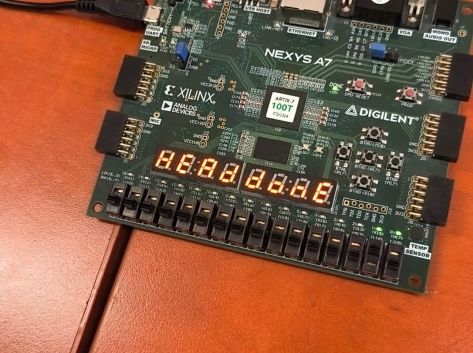
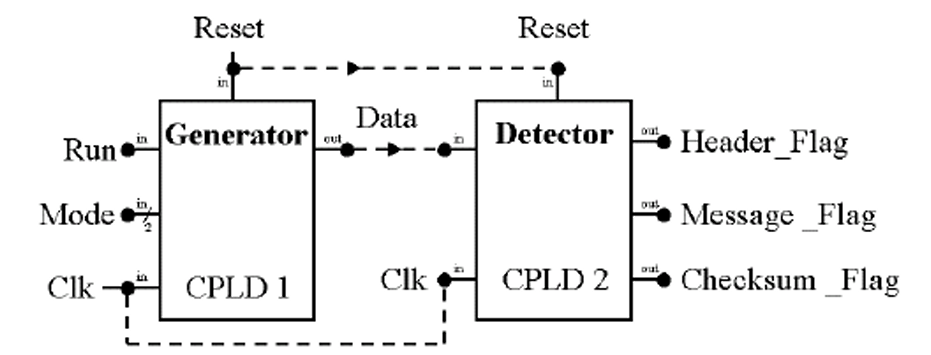
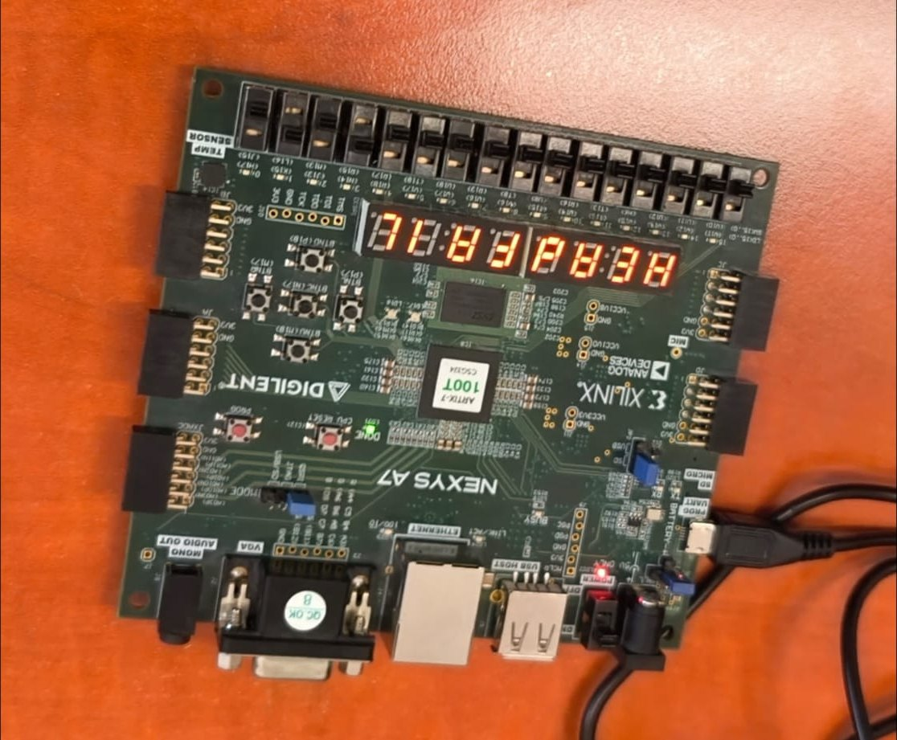
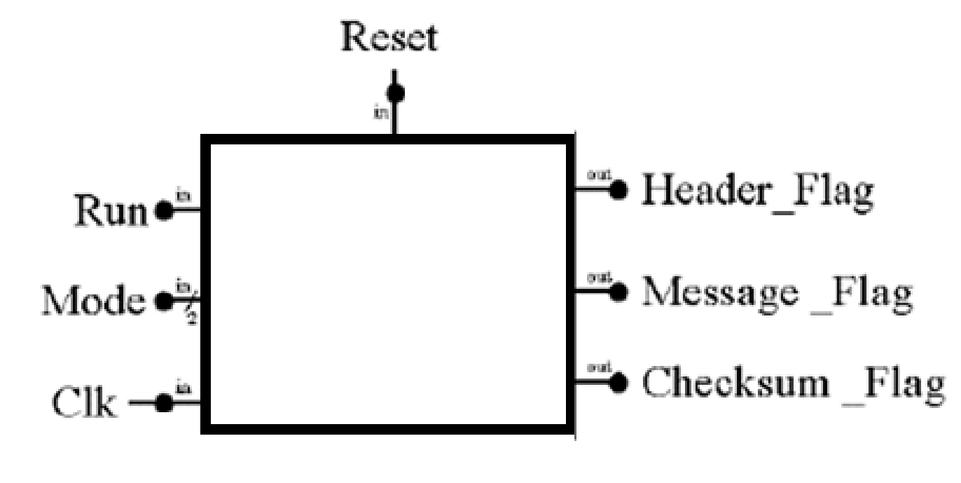
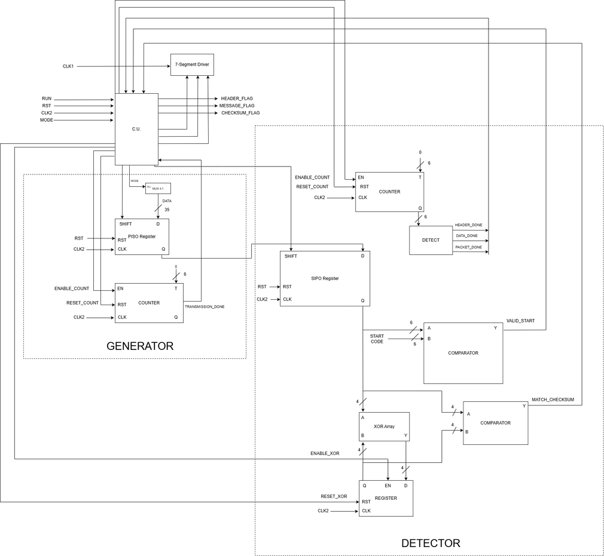

# Serial Data Transmission System with Checksum Validation

A serial communication prototype implemented in VHDL and deployed on a Digilent **Nexys A7-100T** FPGA. The system transmits 35-bit data packets over a single serial line, validates them on arrival with an XOR checksum, and reports the outcome on the board's LEDs and seven-segment display.

Built as a Digital System Design project at the **Technical University of Cluj-Napoca**.



*Running on hardware: the display reads `HEAD DONE` after the Detector validates a correct start segment.*

---

## What it does

Two independent blocks talk to each other over a one-bit serial line, the way a real transmitter and receiver would.

**Generator (transmitter)** loads a packet into a PISO shift register and clocks it out one bit at a time. A 2-bit `MODE` input selects which of four packets it sends — two valid, two deliberately corrupted, so the receiver's error handling can be demonstrated rather than asserted.

**Detector (receiver)** captures the stream into a SIPO shift register, validates the start code against a hardcoded value, computes a running XOR checksum over the payload as each 4-bit BCD word arrives, and compares it against the checksum at the end of the packet.



### Packet format

| Segment | Width | Contents |
|---|---|---|
| Start segment | 7 bits | 1 start bit (always `0`) + 6-bit start code |
| Data segment | 16 / 20 / 24 bits | 4, 5 or 6 words of 4-bit BCD (values 0–9) |
| Checksum | 4 bits | XOR of all BCD words in the data segment |

The line idles at logic `1`. A falling edge to `0` marks the start bit.

### Transmission modes

| MODE | Behaviour | Expected result |
|---|---|---|
| `00` | Valid header, packet A, valid checksum | `HEAD DONE` → `CSUM DONE` |
| `01` | Valid header, packet B, valid checksum | `HEAD DONE` → `CSUM DONE` |
| `10` | **Invalid start code** | `HEAD FAIL`, all flags drop |
| `11` | Valid header, **corrupted checksum** | `HEAD DONE` → `CSUM FAIL` |



*Mode `10`: the Detector rejects the corrupted start code and reports `HEAD FAIL`.*

### Interface



**Inputs:** `RST` (reset), `RUN` (start transmission), `MODE[1:0]` (packet selection), `CLK`
**Outputs:** `HEADER_FLAG`, `MESSAGE_FLAG`, `CHECKSUM_FLAG`, and messages on the seven-segment display

---

## Architecture

Each block splits into a **control unit** (a finite state machine) and an **execution unit** (the datapath) — the standard FSMD separation.



Detector datapath resources:

- **6-bit bit counter** — tracks position within the packet (35 bits maximum), raising `HEADER_DONE`, `DATA_DONE` and `PACKET_DONE`
- **SIPO shift register** — captures the incoming serial stream
- **Start code comparator** — compares the 6 captured bits against the expected code, producing `VALID_START`
- **XOR array + 4-bit register** — accumulates the running checksum
- **Checksum comparator** — produces `MATCH_CHECKSUM`

Generator datapath: a 4-to-1 multiplexer selects the packet by `MODE`, a 35-bit PISO register shifts it out, and a counter raises `TRANSMISSION_DONE`.

---

## Two problems worth reading about

Most of the engineering in this project went into two failures that only appeared on real hardware.

### 1. Infinite false-restart loop on a corrupted header

**Symptom.** In `MODE = 10` (bad start code), the receiver got stuck restarting forever instead of rejecting the packet once and waiting.

**Cause.** On detecting a bad start code, the control unit returned straight to `IDLE`. But the Generator was still shifting out the remaining ~28 bits of that corrupted packet. Since the line idles at `1` and a start bit is a `0`, **every zero bit inside the payload looked like a brand-new start bit.** The receiver was re-triggering on its own garbage. The detection logic was correct in isolation; the fault was that the two units had silently lost synchronisation.

**Fix.** A `FLUSH_PACKET` state. On header failure the control unit drops its flags immediately but keeps counting incoming bits until `PACKET_DONE` fires, only then returning to `IDLE` — so it re-arms when the line is genuinely clear.

### 2. Seven-segment display broke when the clock was slowed

**Symptom.** Driving the design at 1 Hz to make bit-shifting visible on the LEDs killed the seven-segment display.

**Cause.** The display relies on fast multiplexing across its digits. Dividing the global clock to 1 Hz starved it.

**Fix.** A dual-clock architecture at the top level. The generated 1 Hz clock drives only the Generator and Detector logic; the native 100 MHz board clock stays routed to the seven-segment driver.

```vhdl
signal   slow_clk  : std_logic := '0';
constant MAX_COUNT : integer   := 49_999_999;  -- 50M cycles toggles clock = 1 Hz period
signal   count     : integer range 0 to MAX_COUNT := 0;
begin
    process(CLK, RST)
    begin
        if RST = '1' then
            count    <= 0;
            slow_clk <= '0';
        elsif rising_edge(CLK) then
            if count = MAX_COUNT then
                count    <= 0;
                slow_clk <= not slow_clk;
            else
                count <= count + 1;
            end if;
        end if;
    end process;
```

### 3. A smaller one: the phantom read

The PISO register reset to all zeros, which pulled the idle line low the instant the board was reset — triggering a read before `RUN` was ever pressed. Fixed by initialising the register's internal vector to all `1`s, matching the protocol's idle state. A reset value is not a neutral choice; it has to mean *"nothing is happening"* in the protocol, not just zero.

---

## Running it

Requires **Xilinx Vivado** and a **Digilent Nexys A7-100T** board.

1. Create a project in Vivado and add all sources from `src/`.
2. Add `constraints/Nexys-A7-100T-Master.xdc` and uncomment the pins in use.
3. Set `data_transmission_top_level.vhd` as the top module.
4. Run synthesis and implementation, then generate the bitstream.
5. Program the board.

**Operating procedure:** toggle `RST` to initialise → set the `MODE` switches → raise `RUN` → watch the flags and the display.

---

## Repository layout

```
src/                 17 VHDL modules — generator, detector, control units, datapath
constraints/         Nexys A7-100T pin constraints
docs/
  design-document.pdf    Full 21-page design document
  figures/               Block, logic and black-box diagrams; hardware photos
```

**Full documentation:** [`docs/design-document.pdf`](docs/design-document.pdf) — 21 pages covering specifications, resource derivation, control unit state diagrams, the detailed datapath, a user manual, and written justifications for each design decision.

---

## Further development

- **Dynamic payloads.** Replace the hardcoded packets with a UART receiver, so a string typed on a PC terminal is packetised with a computed header and checksum and transmitted live.
- **Error correction.** The XOR checksum detects corruption but cannot repair it. A Hamming (7,4) code or CRC would let the receiver isolate and flip the corrupted bit without a retransmission.

---

## References

Perry, *VHDL: Programming By Example* (2002) · Wakerly, *Digital Design: Principles and Practices* · Hopcroft, *Introduction to Automata Theory, Languages, and Computation* (2007)
